# <center>《数字信号处理》课程实验报告</center>
## <center>实验3 滤波器设计与滤波器特性分析</center>
#### <center>应奇峻 PB15000134</center>
#### <center>2019年1月3日</center>
### 1. 实验目的
1. 掌握Matlab下滤波器设计工具(fdatool)的使用方法。
2. 掌握IIR滤波器设计方法与FIR滤波器设计方法。
3. 了解IIR滤波器设计与FIR滤波器设计方法的差异。
4. 掌握滤波器特性分析的方法。
5. 了解Matlab中sptool工具的使用方法。

### 2. 实验原理
本实验利用Matlab的工具fdatool完成。

### 3. 结果讨论
#### 3.1 IIR滤波器设计
##### 1、Chebyshev高通滤波器
根据要求调整fdatool的参数，得出满足条件的Chebyshev高通滤波器的传递函数为$$H(z)=\frac{0.0262(1-4z^{-1}+6z^{-2}-4z^{-3}+z^{-4})}{1+1.5289z^{-1}+1.6537z^{-2}+0.9452z^{-3}+0.2796z^{-4}}.$$幅频特性曲线如下图所示：

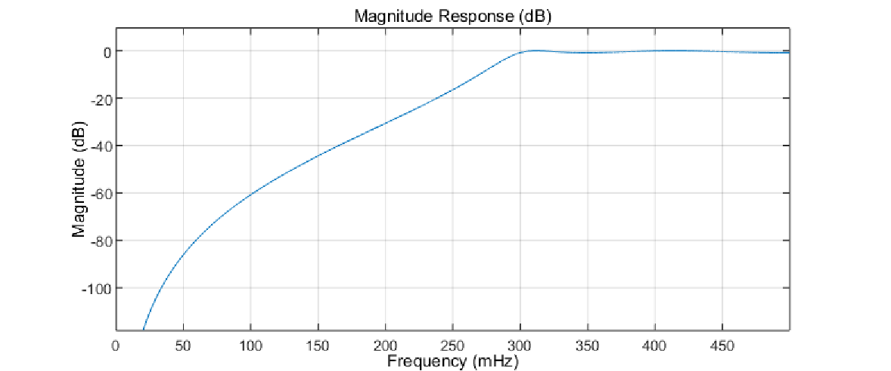

显而易见，滤波器满足要求。
##### 2、低通滤波器
根据要求调整fdatool的参数，得出满足条件的低通滤波器的传递函数为$$H(z)=\frac{0.0243(1+4z^{-1}+6z^{-2}+4z^{-3}+z^{-4})}{1-1.5977z^{-1}+1.7459z^{-2}-1.02z^{-3}+0.3074z^{-4}}.$$幅频特性曲线如下图所示：


显而易见，滤波器满足要求。
##### 3、Butterworth带通滤波器
根据要求调整fdatool的参数，得出满足条件的低通滤波器的传递函数为$$H(z)=\frac{0.0002023(1-7z^{-2}+21z^{-4}-35z^{-6}+35z^{-8}-21z^{-10}+7z^{-12}-z^{-14})}{1+3.7738z^{-2}+6.5614z^{-4}+6.6518z^{-6}+4.203z^{-8}+1.6437z^{-10}+0.3666z^{-12}+0.0359z^{-14}}.$$幅频特性曲线如下图所示：


显而易见，滤波器满足要求。
#### 3.2 FIR滤波器设计
##### 1、Hanning窗带通滤波器
根据要求调整fdatool的参数。

$N=15$时，幅频特性曲线如下所示：


实际3dB带宽为$9Hz$，20dB带宽为$28Hz$。

$N=45$时，幅频特性曲线如下所示

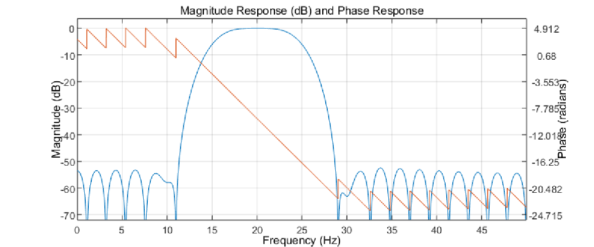

可见N越大，通带带宽越窄，阻带衰减越大，滤波效果越好；同时相变周期越短、相变幅度越小。

##### 2、矩形窗和Blackman窗带通滤波器
$N=15,45$时的矩形窗滤波器如下：


$N=15,45$时的Blackman窗滤波器如下：


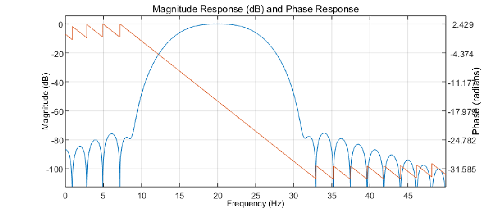

比较不同N的情况，可以得到同上结论：N越大，通带带宽越窄，阻带衰减越大，滤波效果越好；同时相变周期越短、相变幅度越小。

此外相比起来，矩形窗通带最窄，阻带衰减最小；Hanning窗过渡带最窄，阻带衰减最大，效果和Blackman窗相近；Blackman窗通带最宽，旁瓣衰减很大，相比来说噪音最小。
##### 3、Kaiser窗线性相位滤波器
$\beta=4,6,8$时的Kaiser窗线性相位滤波器分别如下所示：


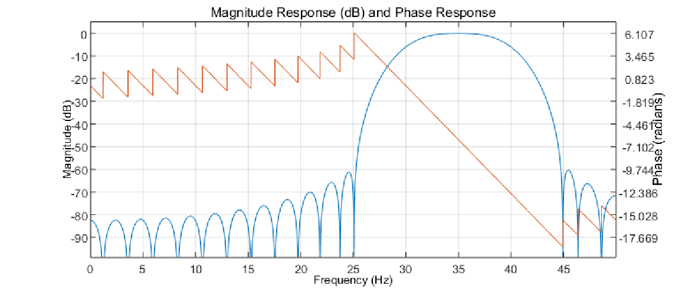


可以看到相位和频幅离通带越远，波动范围越小，频率也越小；通带弧形下降，过渡带较宽。

$\beta$越大，旁瓣频率越大，通带越宽，过渡带也越宽。
#### 3.3 滤波器特性分析
基于Blackman窗函数的FIR设计方法重新设计三款IIR滤波器。比较幅频特性、相频特性、零极点、群延时、相位延时。

将FIR高通滤波器的频率特性曲线和IIR进行对比，结果分析在本节最后进行。

##### 1、高通滤波器
###### 频幅和相位特性

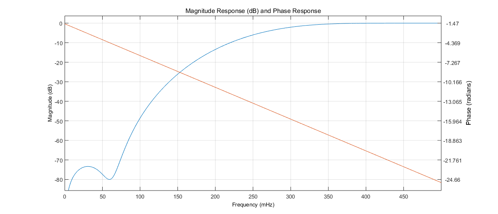
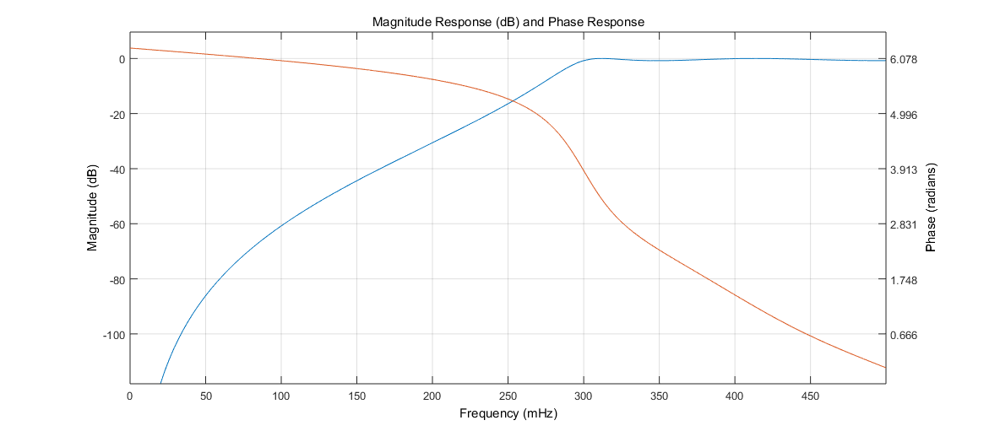

###### 零极点

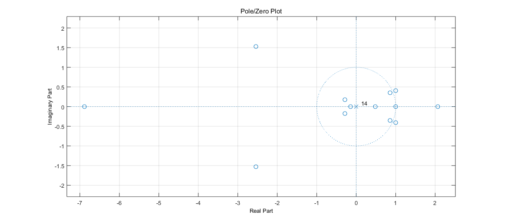


###### 群延时


###### 相位延时

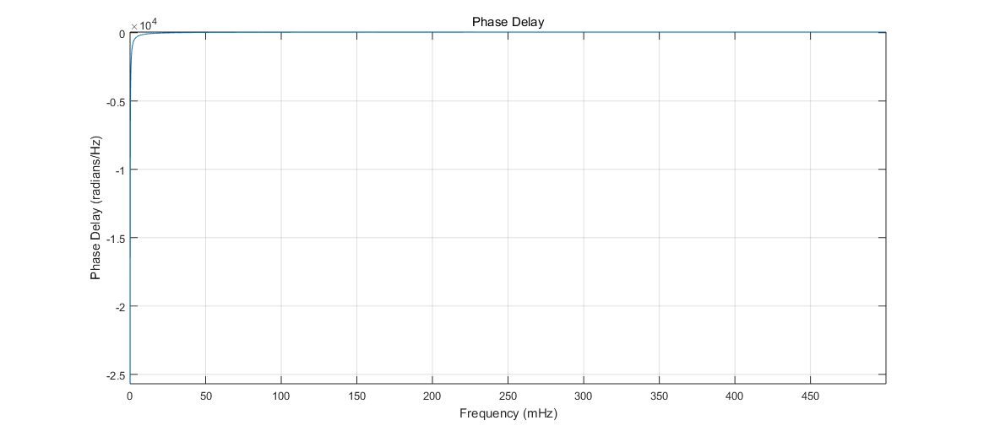
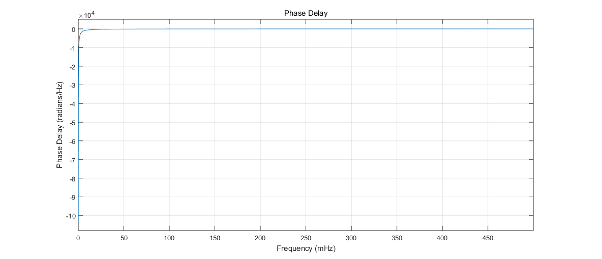

##### 2、低通滤波器
###### 频幅和相位特性

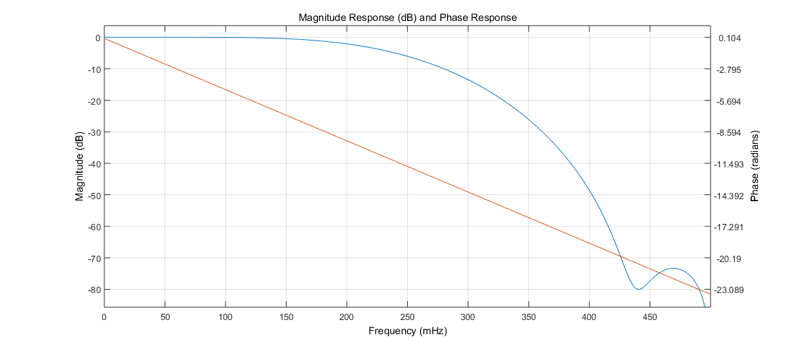


###### 零极点


###### 群延时

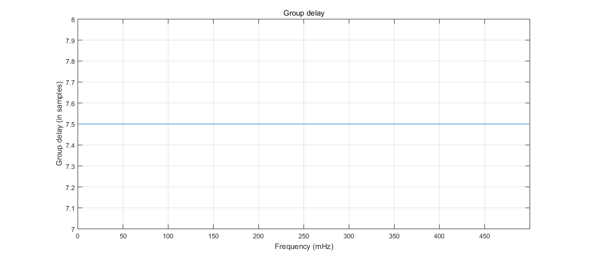
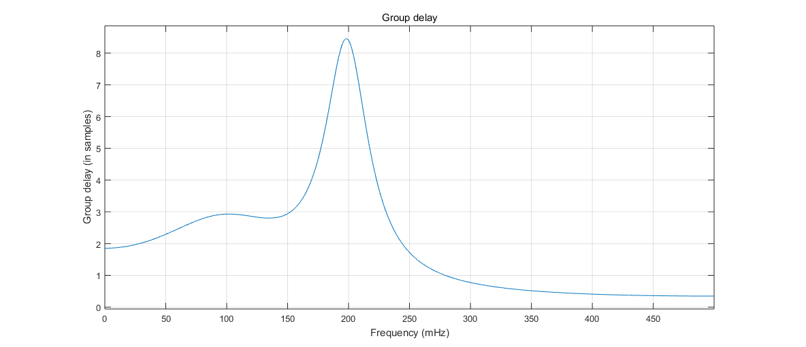

###### 相位延时

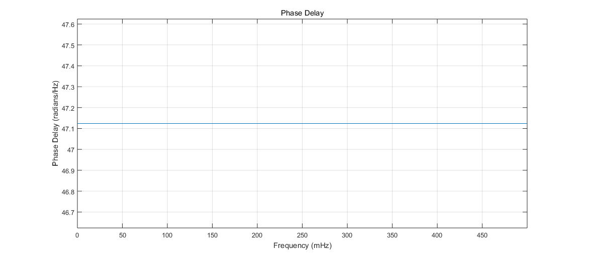
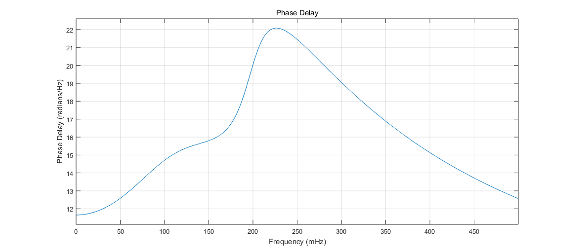

##### 3、带通滤波器
###### 频幅和相位特性

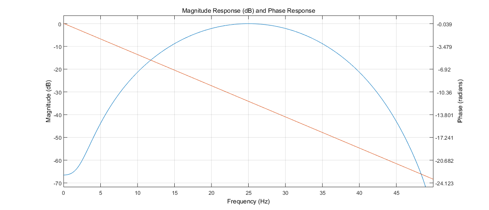
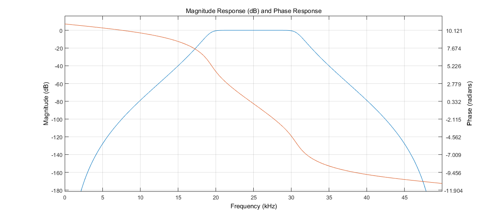

###### 零极点

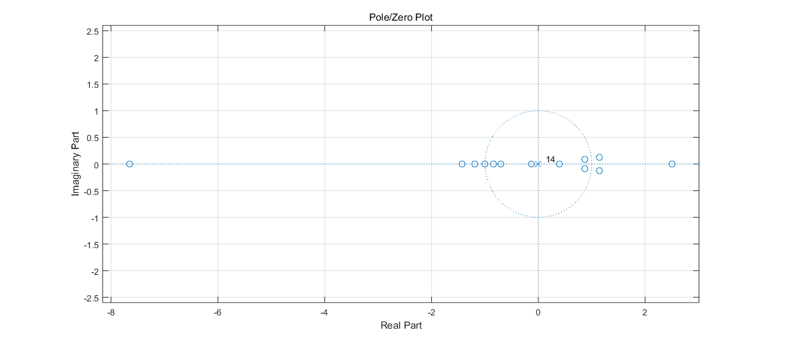
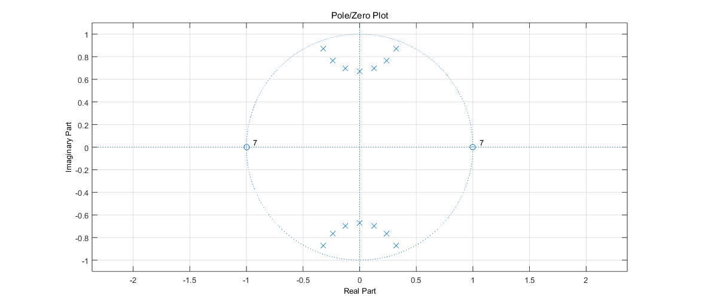

###### 群延时


###### 相位延时


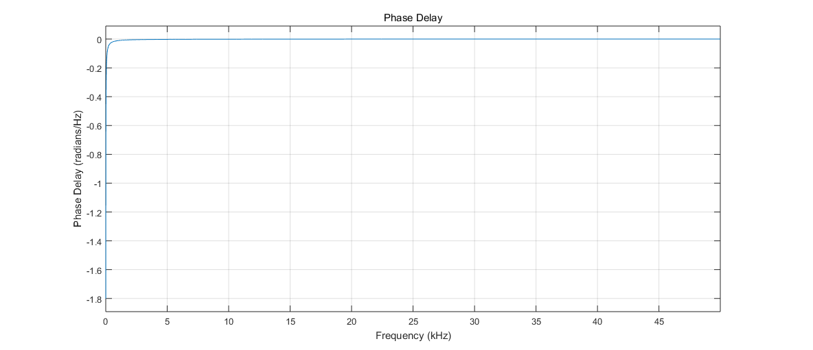

##### 4、结果分析
FIR和IIR的零极点分别如上所示。可见FIR零点比IIR多得多，且四类都有，而IIR集中在1点。

实现相同性能指标的滤波器，IIR所需的阶数远小于FIR。IIR有着优异的幅度响应特性，然此优越性的代价是非线性。相对的，FIR恰可构成线性相位滤波器，不同频率的正弦波产生的相移和正弦波频率成直线关系。因此，除相频特性决定的延迟外，可不失真地保留通带以内的全部信号。

线性相位等驾驭群延时为常数，当N为奇数时，滤波器群延时是取样间隔的整数倍；当N为偶数时，群延时是取样间隔整数倍再加半个。

零极点分布上，由于FIR滤波器的单位脉冲响应$h(n)$仅含有有限个非零值，是因果的有限长序列。其z变换的特点可知，其零点可位于有限Z平面内的任何位置，剩下的极点均位于$z=0$处。
IIR的零点分布没有限制，极点分布在单位圆内。故有的资料将FIR称为全零点系统，将IIR称为极零系统。

#### 3.4 滤波器的实际运用
##### 1、信号特性
信号通过如下方式获得：

``` matlab
n = 1:100000;
fs = 1000;f1 = 50;f2 = 200;
x = 0.5 + 1.2*sin(2*pi*f1*n/fs) + 0.5*cos(2*pi*f2*n/fs);
>> x = x + 0.1*randn(size(x));
```

将结果导入sptool中，进行FFT分析。频谱如下所示：


##### 2、Butterworth低通滤波器
低通滤波器的特性如下所示。


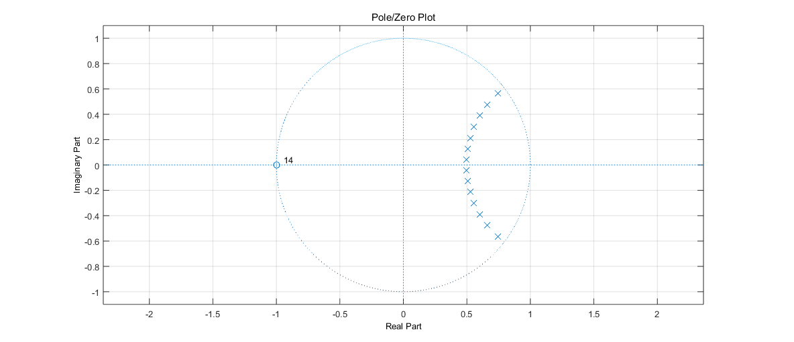
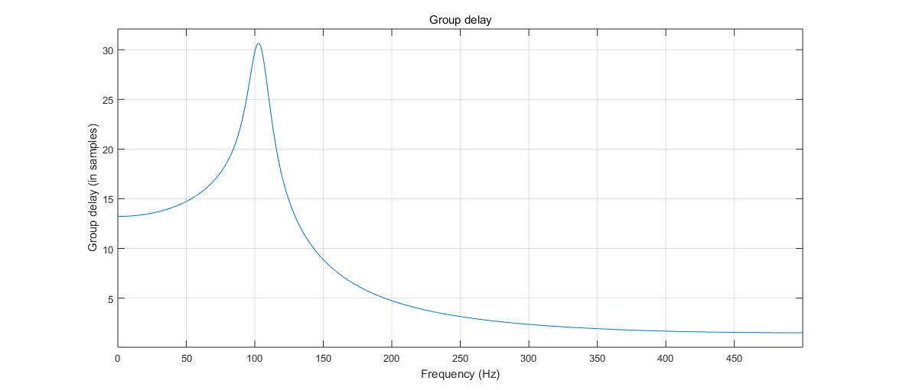


##### 3、低通滤波结果
信号通过Butterworth滤波器后频谱如下所示：

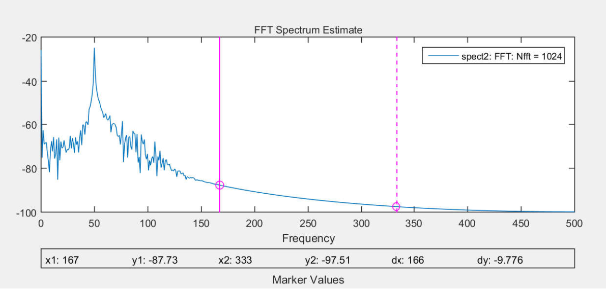

对比原信号：


明显看到，$200Hz$的分量已被滤除，只剩直流分量和$50Hz$分量了。

##### 4、Kaiser带通滤波器
设计Kaiser带通滤波器，其频谱如下所示：

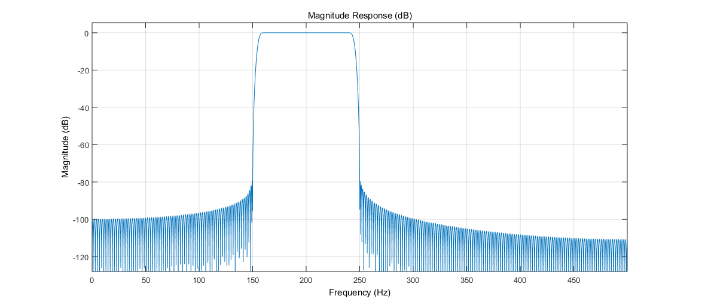

将信号通过上述滤波器，得到的信号频谱如下：


可以看到，直流分量和$50Hz$的分量已经基本滤除，只剩下了$200Hz$的分量。

### 4. 总结分析
#### 4.1 IIR滤波器和FIR滤波器的优缺点
IIR和FIR滤波器的优缺点前面已经阐述，在这里进行简略概括。

为实现相同的目的，IIR阶数比FIR小得多。

同时FIR是线性相位因果序列，可以不失真地保留大多数数据。

IIR是全零点系统，FIR是极零系统。

#### 4.2 实验结论
##### IIR滤波器幅频特性模型的选取
Butterworth滤波器的频率特性曲线，无论在通带和阻带中都是频率的单调函数。因此，当通带的边界处满足指标要求时，通带内肯定会有裕量。
显然，更有效的设计方法应该是将精确度均匀地分布在整个阻带或通带内，或者同吋分布在两者之内。这样就可以用阶数较低的系统满足要求。这可以通过选择具有等纹波特性的逼近函数来实现。

而切比雪夫滤波器的频率特性就满足前面一种等纹波特性（通带、阻带）内等纹波， 阻带（通带内单调）。

本实验米涉及的椭圆滤波器则具有后一种等纹波特性（通带和阻带内均等纹波）。

综上分析，当滤波器性能指标相同时，实现所需的阶数N：
椭圆滤波器<切比雪夫滤波器<巴特沃斯滤波器。

##### 传递函数
fdtool中传递函数由SOS矩阵实现，可是无法根据参数直接写出，这时需要用到matlab函数。

使用matlab的sos2tf函数，可以求出传递函数的矩阵。具体实现如下：
```Matlab
[b,a] = sos2tf(sos,G)
```
##### 个人小结
本次实验，我由如下收获。

①掌握了MATLAB屮使用fdatool工具箱和sptool工具箱进行滤波器设计和信号处理的方法。

②加深了对FIR和IIR滤波器的设计方法的掌握，同时对滤波器各项性能指标的物理意义有了更直观的认识，掌握了滤波器特性分析的方法。

③巩固了对于HR和IIR两种数字滤波器的差异，同一类滤波器不同设计方法的差异的认识。
